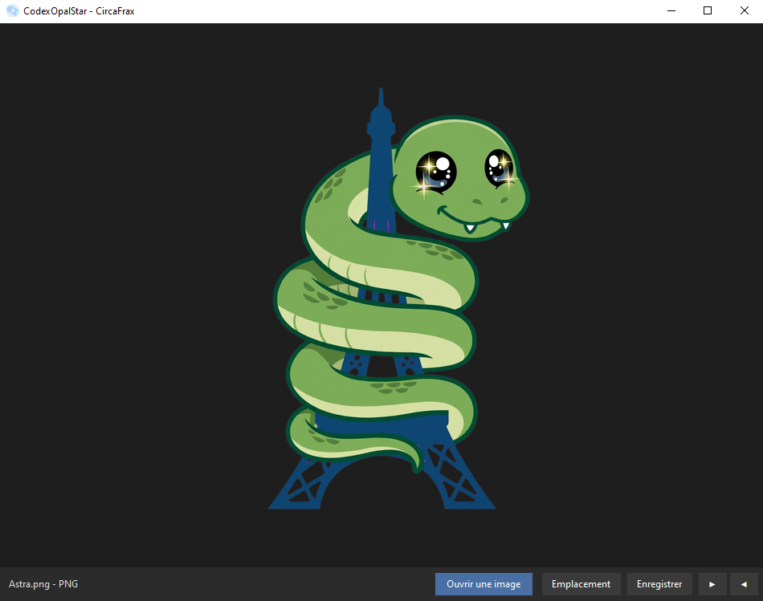

<p align="center">
  
</p>

# CodexOpaleStar v1.0.0 - La visionneuse image libre

<p align="center">
  
</p>

<p align="center">
  
  
  
  
</p>

<p align="center">

### ⬇️ [Télécharger CodexOpaleStar v1.0.0 (Windows)](https://github.com/CircaFrax/CodexOpaleStar/releases/download/v1.0.0/CodexOpaleStar_v1.0.0.zip)

`SHA256: 6fbf8d09f21bf7ee141a1e3d4c9a8a28e9cfde187f9788a730455f7326608b8d`

</p>

---

### Pourquoi CodexOpaleStar ?

Les visionneuses intégrées disposent de centaines de boutons, d'options, de modes, intègrent des fonctions absurdes.
CodexOpaleStar est sous licence CircaFrax, c'est a dire, c'est en local, c'est sur votre PC, ca n'appartiens pas a une mégastructure.
n'est pas modifié a la suite d'une quelconque mise a jour, ne scanne pas automatiquement toute les images de vos supports connectés.

> Conçu pour les documents provés : particuliers, entreprises, associations.

## ✨ Un logiciel, pleins de formats

- **avif**
- **avifs**
- **bmp**
- **dib**
- **gif**
- **ico**
- **jfif**
- **jpeg**
- **jpg**
- **png**
- **tif**
- **tiff**
- **webp**

> ça veux dire quoi tout ces formats? bien, affichez, et enregistrez, grace au core CircaFrax.

## Aperçu

*Interface affichage – Menu et info en bas, clic droit pour action rapide*

### 📁 Contenu du Zip

```
CodexOpalStar/
├── CodexOpalStar.exe
├── LICENCE.md
├── LICENSE.md
└── THIRD_PARTY_LICENSES.md
```

Pas d'installation. Double-clic et c'est parti, comme en 1998 mais en mieux.
Si vous voulez en faire la visionneuse par défaut, sélectionnez un fichier, faites clic droit/ouvrir avec/choisir une autre application, en cochant bien "toujour utiliser cette application". ensuite sélectionnez CodexOpaleStar, que vous aurez rangé dans ProgramFiles\codex par exemple, selectionnez le en cochant "toujour utiliser".
Autrement, utilisez le comme un logiciel d'apperçu et de transformation de format.

### 🔒 Confidentialité

- **Zéro réseau** : 100% offline, vérifiable au pare-feu
- **Zéro collecte** : n'écrit que les fichiers que vous demandez
- **100% légal** : licences open-source permissives complètes incluses dans le zip
- **Code source privé** : CircaFrax Proprietary Freeware v1.0

### 📄 Licence

Gratuit à vie, usage perso / associatif / pro / commercial. Distribution libre à l'identique avec les fichiers de licence.

Voir `LICENCE.md` et `THIRD_PARTY_LICENSES.md` inclus.

---

**Fait partie de la suite Codex** — des outils offline CircaFrax.
**CircaFrax - Astra - Marque de référence**
